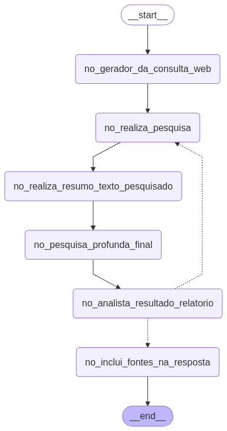

# Deep Research Simplificado com LangGraph

<div align="center">
  <p>Um workflow simplificado para pesquisa profunda automatizada usando LangGraph 🔍</p>
  
</div>

## 🌟 Sobre o Projeto

**Deep Research Simplificado** é um projeto para criar pesquisas profundas sobre qualquer tópico usando LangGraph. Este projeto implementa um fluxo de trabalho orientado a grafos que automatiza a busca, organização e síntese de informações de múltiplas fontes.


### 🎥 Tutorial Completo

Para uma explicação detalhada do projeto e instruções passo a passo, confira o [tutorial completo no YouTube](https://youtu.be/uDKraAVCECU).

## 🛠️ Tecnologias Utilizadas

- **LangGraph**: Framework para criação de fluxos orientados a grafos para agentes de IA
- **LangChain**: Para integração com modelos de linguagem e ferramentas
- **DuckDuckGo Search API**: Realiza buscas na web sem limitações da API do Google
- **Chainlit**: Cria interfaces de usuário interativas para o fluxo de trabalho
- **Python 3.11+**: Linguagem base do projeto

## 🚀 Instalação

1. Clone o repositório:
```bash
git clone https://github.com/gustavo-sacchi/study-agent-ai.git
cd deep-research-simplificado
```

2. Instale as dependências:
```bash
pip install -r requirements.txt
```

3. Configure suas chaves de API:
```bash
cp .env.example .env
# Edite o arquivo .env com suas chaves de API
```

## 📋 Funcionalidades

O fluxo de Deep Research implementa os seguintes componentes:

- **Consulta Web**: Gera consultas otimizadas para busca na web
- **Sumarizador**: Extrai e sintetiza informações relevantes das páginas web
- **Escritor de Pesquisa**: Elabora documentos detalhados sobre o tópico pesquisado
- **Analista**: Verifica se as informações são suficientes ou se precisam de mais pesquisa
- **Inclusão de Fontes**: Adiciona referências bibliográficas ao documento final
- **Interface Interativa**: Permite interagir com o fluxo de pesquisa

## 🔍 Arquitetura

O fluxo de trabalho é composto por nós interconectados que processam informações sequencialmente:

```
[START] → [Gerador de Consulta Web] → [Pesquisador API DDG] → [Sumarizador]
        → [Escritor de Pesquisa] → [Analista de Gaps] → [Decisão Condicional]
        → [Inclusão de Fontes] → [END] ou retorno para nova pesquisa
```

Cada nó no grafo representa uma etapa de execução de trabalho e retorna um estado atualizado para os próximos nós.

## 💻 Como Usar

### Executando o fluxo de pesquisa:

```bash
# Para iniciar a interface Chainlit
chainlit run deep_research_simplificado/interface.py -w
```

## 📊 Caso de Uso

Este projeto foi projetado para diversos casos de uso:

- **Pesquisa Acadêmica**: Automatize a coleta de informações para trabalhos acadêmicos
- **Análise de Mercado**: Pesquise tendências e informações sobre mercados específicos
- **Criação de Conteúdo**: Gere bases sólidas para artigos e posts de blog
- **Educação**: Aprenda sobre novos tópicos de forma estruturada e aprofundada